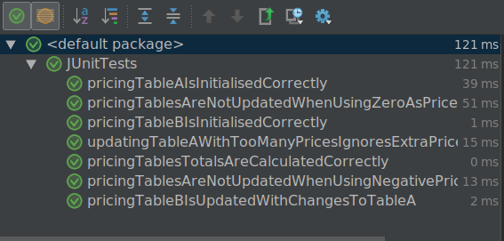

#### Part 2
> Table A below represents an example of a pricing table containing a number of products and their varieties.
The prices of these products are in pounds sterling.

> Table B represents the same products and varieties with their prices converted to Euros. The value in each cell
of Table B is calculated from the value in the corresponding cell in Table A.
In other words: Value (Product1, Variety1) in “Table B” = (Value (Product1, Variety1) in “Table A”) * conversion
rate. In the example below, the conversion rate is 1.5.
The shaded cells should not contain values.
The value in each cell in the bottom row is equal to the sum of the values in the corresponding column.

> Table A - Prices in Sterling

>|   | Variety 1  | Variety 2  | Variety 3  | Variety 4 |
|---|---|---|---|---|
| Product1 | 10  | 12  | 14  | 45 |
| Product2 | 20  | 15  | 24  |   |
| Product3 | 22  | 60  |   |   |
| Product4 | 28  |   |   |   |
| Total | 80  | 130.5  | 38  | 45 |

> Table B - Prices in Euro

>|   | Variety 1  | Variety 2  | Variety 3  | Variety 4 |
|---|---|---|---|---|
| Product1 | 15  | 18  | 21  | 67.5 |
| Product2 | 30  | 22.5  | 36  |   |
| Product3 | 33  | 90  |   |   |
| Product4 | 42  |   |   |   |
| Total | 120  | 130.5  | 57  | 67.5 |

>Exercise: write a test to check the correctness of Table B in relation to Table A. Consideration should be given
to the variety of possible errors conditions within other real-world data, and how these can be tested. We are
not concerned solely with whether or not the test works, but also with how tidy, structured and robust it is.

Coding using Oracle Java 8 SDK (1.8.0_171).

Unit Tests use the JUnit 4 Framework (embedded with IntelliJ Idea)

This shows "evidence" of the tests run (if you can believe a picture :smile: )

